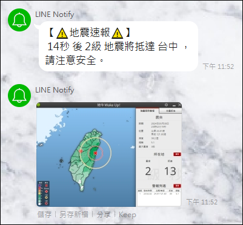

# EarthquakeNotifyWithLineNotifyAndTelegramBOT

這是一個使用 [地牛 Wake Up!](https://earthquake.tw) 來串接並執行 LINE NOTIFY 和 Telegram Bot 的地震通知程式。

當地震發生時，本程式會自動向指定的 LINE 和 Telegram 群組或用戶發送通知，提醒地震來了。




## 功能
- 自動接收 地牛 Wake Up! 地震警報
- 通過 LINE NOTIFY 發送地震通知
- 通過 Telegram Bot 發送地震通知
- 支持自定義通知訊息格式

## 使用
1. 啟動地震通知程式，這邊我的使用方式是撰寫一個 .bat file 去執行：
    ```sh
    python earthquake_notify.py %1 %2 
    ```
